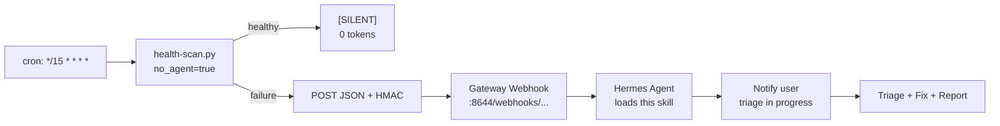

## Reference Library

| Document | Function | Load When... |
|----------|----------|--------------|
| `references/docker-container-recovery.md` | Docker timing-window diagnosis: distinguish self-healed containers from genuine outages using inspect timestamps, restart counts, and scan-time cross-referencing | • Docker probe failures • Container not running • Docker container health |
| `references/cron-pitfalls.md` | Debugging cron-launched Hermes jobs: `HOME` unreliability, Python venv resolution, launchd/minimal `PATH`, `no_agent=true` stdout rules, cross-platform cron pitfalls | • Cron job won't start or silently fails • "can't find python" in cron • Script runs in terminal but not in cron |
| `references/webhook-delivery-format.md` | Webhook `--deliver` vs cronjob `deliver` format mismatch: `--deliver` takes bare platform name + separate `--deliver-chat-id`; the combined `platform:chat_id` format produces "Unknown deliver type" errors | • "Unknown deliver type" error • Webhook subscription creation • Triage agent output never arrives |
| `references/probe-design.md` | Core probe design philosophy: concrete observable unit tests vs. assumption-based checks. Covers process/HTTP/Docker/disk/DNS probes, SSH tunnel intercept, SSE 406 handling, interface binding, and `passes_if` inequality limitation | • Writing new probes • Probe always fails but service is healthy • Designing health checks from scratch |
| `references/probe-onboarding.md` | Step-by-step HTTP probe validation workflow: verify process is running, `lsof` to find what's on the port, curl-test the exact endpoint, cross-reference with process state, run full scanner | • Adding a new HTTP probe • Onboarding a new service to the watchdog • "My probe always fails" |
| `references/env-var-wiring.md` | Three-way HMAC secret match: `WEBHOOK_SECRET` in `.env`, `config.yaml`, and `webhook_subscriptions.json`. Full chain from shell wrapper → Python → gateway verification | • "Webhook POST failed: HTTP Error 401" • Auth failures on webhook POST • First-time watchdog setup |
| `references/probe-debugging.md` | Real-world process probe debugging: `--` flag trap on BSD grep, finding a process by port via `lsof` → `ps`, character class trick, pre-catalog verification, process+HTTP cross-reference matrix | • Process probe fails • "grep: unrecognized option" • First-run probe config bugs |
| `references/skill-onboarding-and-configuration.md` | 8-phase onboarding plan: install, introspection, webhook, cron, probes, testing, user approval, production. Also covers repair/diagnostics for the skill itself | • First-time setup • Reconfiguration after migration • Repair when cron/webhook/catalog is broken |
| `references/service-discovery-catalog.md` | Comprehensive list of discoverable Hermes services organized by layer: system, Hermes core, MCP/plugins, messaging, Docker, unsupervised processes — with probe commands for each | • Introspection/Phase 2 • "Find what services I have" • Onboarding on a new machine |

**Critical loading rule:** Load `skill-onboarding-and-configuration.md` and `service-discovery-catalog.md` ONLY in Context B (setup/reconfig/repair). NEVER load them during routine failure triage (Context A). See "Agent Guidance" below.

---

## Agent Guidance: Reference Loading Contexts

This skill runs in **two distinct contexts**. Loading the wrong reference wastes tokens and confuses the agent. Read these headers to determine your context before loading anything.

### Context A — Failure Triage (webhook-triggered)

**You are here if:** This session was started by a webhook POST from `health-scan.py`. The `{payload}` contains `failed_services` and probe results for specific services.

**Your job:** Triage the failed services listed in `failed_services`. Run what diagnosis you can within available tools, document fixes, and report to the user with the exact commands they should run (or delegate via a cron job that has CLI-level tools).

**⚠️ Webhook tool restriction:** Webhook sessions are restricted to `web_search`, `web_extract`, `vision_analyze`, and `clarify` by default — **no terminal, no file ops**. The agent cannot run shell commands to diagnose or fix. See [Webhook Tool Restriction](#webhook-tool-restriction) for how to grant full access.

**Workarounds for the terminal gap:**
- **Report what to run** — the safe default. List the service name, the failed probe, and the exact shell command needed to fix it. The user sees the report in their chat channel and can run the command.
- **Delegate to a cron job** — if a cron job exists that can run the fix (e.g. `hermes cron run <job_id>`), report the job ID to the user. Not available from the webhook agent itself.
- **Escalate to full-CLI cron** — if the deployment has a "Stage 2 heartbeat" cron job (or similar) that loads this skill and has full CLI tools, that cron can do the repair. Configure it to run every 10-15 minutes with `hermes cron create` from a CLI session.

**To enable terminal for webhook-triggered sessions (requires user action in a CLI session):**

Option 1 — interactive (easiest for exploration):
```bash
hermes tools
```
Navigate to the 🔗 Webhook platform, enable the full `hermes-cli` toolset.

Option 2 — direct config (best for repeatable setup, no TUI needed):
```bash
hermes config set platform_toolsets.webhook '["hermes-cli"]'
```
This replaces the restricted `hermes-webhook` toolset with the full CLI toolset, giving the webhook session terminal, file, cronjob, and all other default tools.

Safe to do when the gateway binds to `127.0.0.1` only (not safe for public-facing webhooks).

**Reference loading rules for Context A:**
- **Load** only the reference file(s) matching the failure type(s) in `failed_services`. Example: a Docker container reported down → load `references/docker-container-recovery.md`.
- **DO NOT load** `references/skill-onboarding-and-configuration.md`. It's a full 8-phase onboarding plan (~22KB). Loading it during a routine Docker or gateway triage wastes tokens and adds nothing useful.
- If `failed_services` is empty or status is `ok` → something is wrong with the webhook wiring, not a real failure. Load `references/env-var-wiring.md`.
- Use the SKILL.md body (below) for risk tiers, circuit breaker, safety rules, and cascading failure detection — that content lives here, not in references.

### Context B — Setup / Reconfig / Repair (user-initiated)

**You are here if:** The user directly asked you to set up the system heath watchdog skill, reconfigure it, move it to a new machine, or fix a broken installation. There is no failure payload.

**Your job:** Onboard or repair the watchdog itself, not triage a specific service failure.

**Reference loading rules for Context B:**
- **Load** `references/skill-onboarding-and-configuration.md` — it contains the complete 8-phase plan: install, introspection, webhook creation, cron creation, probe creation, testing, user approval, production handoff.
- **Load** `references/service-discovery-catalog.md` during Phase 2 (introspection) — it provides the comprehensive list of discoverable services organized by layer with probe commands for each.
- Load individual references (like `probe-design.md`, `probe-onboarding.md`, `env-var-wiring.md`) when a specific phase calls for them. The onboarding doc tells you when.

---

Load only the file relevant to the current failure type when in Context A. Loading all eight unconditionally wastes tokens.

---

# System Health Watchdog

Two-stage pipeline: **Stage 1** (`health-scan.py`, `no_agent=True` cron) runs probes from `catalog.local.yaml`, outputs `[SILENT]` when healthy or JSON on failure. On failure, it POSTs the JSON to a Hermes webhook, which triggers **Stage 2** (this skill, agent-driven, webhook fired) to immediately notify the user that triage is in progress, then triage failures, apply fixes from catalog (if terminal access is granted — see [Webhook Tool Restriction](#webhook-tool-restriction)), verify, and report.

## Architecture



## User Notification (Triage in Progress)

The first thing the webhook-triggered agent does on receiving a failure payload is **notify the user** that triage is in progress. This prevents the user from seeing the failure JSON from the cron job output, then wondering if anything is being done about it.

**Behavior:**
- As soon as the agent loads the webhook payload, it sends an initial message to the user's delivery channel (set via `--deliver` on the webhook subscription)
- The message format: 🚨 **Health Watchdog: Triaging N failure(s)** — lists the failed services and says triage and remediation is in progress
- This message is delivered immediately, before any diagnosis or fix actions run
- If the agent finishes fixing and the system is healthy again, a follow-up message reports what was done
- If a fix is `hands_off` or retries are exhausted, the final message explains what needs manual attention

**Implementation note:** The agent uses `send_message(target=<delivery_channel>)` to send the initial notification. The delivery channel is inferred from the webhook subscription's `--deliver` + `--deliver-chat-id` settings — set these to the user's preferred platform and channel (e.g. `--deliver discord --deliver-chat-id 1504091606398140449`). Webhook sessions do not have an `origin` conversation context, so `--deliver origin` silently falls back to the Discord home channel but is not a correct configuration.

> **⚠️ Critical — Webhook tool restriction:**
> The **notification** step works (send_message only). But the **diagnosis and remediation** steps (terminal commands, file reads, docker restart, etc.) require **terminal and file tool access**, which webhook sessions do **not** have by default. See the [Webhook Tool Restriction](#webhook-tool-restriction) section below for how to grant them.

## Token Optimization (Design Principle)

Watchdog skills run frequently. Token waste compounds fast. Every design decision prioritizes zero-token healthy ticks:

1. **Minimal SKILL.md** — keep the loaded skill doc under 4K tokens. Move deep reference material into `references/` files that are loaded conditionally, not unconditionally.

2. **`[SILENT]` protocol** — the pre-scanner prints `[SILENT]` (and nothing else) when healthy. The cron job's `no_agent=True` script sees this and exits. No LLM is invoked on healthy ticks.

3. **Webhook event model** — Stage 2 has NO cron job. It's triggered exclusively by the webhook POST from Stage 1 on failure. Zero tokens consumed when everything's healthy.

4. **`no_agent=true` for the pre-scanner** — pure Python script, no LLM invoked. The script's stdout is delivered verbatim (or the `[SILENT]` protocol kicks in).

5. **Conditional reference loading** — the webhook-triggered agent loads `references/` files only when the pre-scanner detected a failure. Healthy path stays at zero tokens; failure path gets full context.


---

## Webhook Subscription

The pre-scanner's webhook POST triggers an LLM session for triage and remediation. The subscription lives in the **default** profile (`~/.hermes/webhook_subscriptions.json`) served by the default gateway.

**⚠️ Security rule — NEVER display secrets in chat or hardcode them in files.** The HMAC secret lives in `.env` only (`WEBHOOK_SECRET`). Configure the subscription via the CLI using shell expansion from the env var — never write `webhook_subscriptions.json` directly and never paste the secret value into a chat message or command string literal.

- **URL:** `http://localhost:${WEBHOOK_PORT}/webhooks/system-health-alerts`
- **Skill loaded:** `system-health-watchdog`
- **Deliver:** `discord` (platform name only — use `--deliver-chat-id` for the target channel)
  **Deliver chat ID:** `1504091606398140449`
  Never `origin` — webhook sessions have no conversation context to route to

**Recommended (loopback-only):** The default gateway binds to `127.0.0.1:8644` — unreachable from outside the machine. Use `--secret INSECURE_NO_AUTH` to skip HMAC validation entirely. No secret to keep in sync, no drift risk:

```bash
# --deliver takes only the platform name (discord, telegram, etc.)
# --deliver-chat-id specifies the target channel separately
hermes webhook subscribe system-health-alerts \
    --secret INSECURE_NO_AUTH \
    --deliver discord \
    --deliver-chat-id 1504091606398140449 \
    --description "Health pre-scanner failures" \
    --skills system-health-watchdog
```

**⚠️ Shell wrapper port drift pitfall:** If the shell wrapper (`~/.hermes/scripts/health-scan.sh`) hardcodes `http://localhost:8644/webhooks/...`, changing the gateway port later (multi-profile, port conflict) silently breaks the pre-scanner. It should use the env-var-default pattern: `HEALTH_WEBHOOK_URL="${HEALTH_WEBHOOK_URL:-http://localhost:8644/webhooks/system-health-alerts}"`. See `references/skill-onboarding-and-configuration.md` Phase 4 for details.

**Fallback (external gateway):** If the gateway binds to a non-loopback address, use the two-way secret match pattern documented in `references/env-var-wiring.md`. The `--secret` value must be the same as `WEBHOOK_SECRET` in `.env`. Use shell expansion — never hardcode the literal.

## Webhook Tool Restriction (Read Before Using)

Webhook-triggered agent sessions run with an **intentionally constrained toolset** by default. This is a Hermes security measure — webhooks can originate from untrusted third-party content (e.g. public PR titles, GitHub webhooks, external POSTs), so the default toolset is read-only to prevent prompt injection from causing damage.

**Default webhook toolset** (`hermes-webhook`):
- `web_search`, `web_extract` — look things up
- `vision_analyze` — read images
- `clarify` — ask the user a question

**What's MISSING by default** (needed for watchdog remediation):
- `terminal` — run diagnosis commands (`docker inspect`, `curl`, `ps`, `lsof`)
- `read_file`, `write_file`, `search_files` — read/write catalog, logs, configs
- `send_message` — notify the user of triage progress
- All other core tools (skills, file, cron, homeassistant, etc.)

**How to grant terminal + file access:**

In `~/.hermes/config.yaml`, add a `webhook` entry under `platform_toolsets:`:

```yaml
platform_toolsets:
  # other platforms...
  webhook:
  - hermes-cli
```

`hermes-cli` includes the full core toolset: terminal, file ops, skills, delegation, messaging, etc. This is safe on a single-user machine where you control what POSTs to the webhook endpoint. After changing config.yaml, restart the gateway:

```bash
launchctl kickstart gui/$(id -u)/ai.hermes.gateway
```

**⚠️ YAML gotcha:** The value must be a YAML **list**, not a quoted string. This is wrong:

```yaml
  webhook: '["hermes-cli"]'   # ❌ YAML string — silently falls back to read-only default
```

This is correct:

```yaml
  webhook:
  - hermes-cli                  # ✅ YAML list — grants full toolset
```

**Without this config change**, the webhook-triggered agent can only notify you that a failure was detected and explain what needs to be done — it **cannot** run terminal commands to diagnose or fix anything. The user must remediate manually.

## Payload Format

The pre-scanner POSTs the same JSON it prints to stdout. On failure:

```json
{"status": "failures", "failed": 2, "failed_services": ["gateway-default", "my-container"], "results": {"gateway-default": {"name": "Default Gateway", "passed": false, "failed_probes": ["process_running"]}}}
```

The webhook's prompt template injects this as `{payload}`. The agent loads this skill and triages each `failed_services` entry.

## Safety Rules (NEVER SKIP)

1. **Log scan false positive** — service passes process + HTTP probes but fails `log_scan` only → historical artifact, DO NOT restart
2. **Self-healed (launchd/systemd)** — `LastExitStatus=256` (launchd) or exited but process running + endpoint 200 → supervisor already recovered, DO NOT restart
3. **Self-healed (Docker)** — container was down at scan time but `docker inspect` shows running + `RestartCount=0` → Docker already recovered, DO NOT restart
4. **Timing window** — always re-run probes before applying ANY fix. If `[SILENT]` on re-scan → self-healed, report only
5. **No restart on false positive** — restarts drop sessions (Discord offset, Telegram spool), force re-indexing, risk data loss. Log artifacts are never worth this cost

## Risk Tiers

| Risk | Behavior |
|------|----------|
| `safe` | Auto-apply silently, verify, report summary |
| `caution` | Apply + report details |
| `hands_off` | Never auto-apply, report + explain |

## Circuit Breaker

Max **3 auto-remediations** per run. Max **3 retries** per `safe` fix, **1** for `caution`. Escalate to user after exhausted retries regardless of risk tier.

## Cascading Failures

Correlate errors within ±60s:
- `network_down`: DNS fail + multiple MCP connection fails → flush DNS (OS-appropriate command)
- `gateway_crash`: Gateway exit + downstream failures → check gateway logs
- `auth_expired`: 401 across multiple services → check OAuth tokens
- `disk_full`: Write failures across services → `df -h`

Fix dependencies first (DNS before MCP, system before services).

## Extending the Watchdog (Adding New Probes)

When asked to monitor a new service or process, **extend `catalog.local.yaml`** — do NOT create a new watchdog skill or new cron jobs.

The pre-scanner runs at pre-defined intervals via `system-health-pre-scanner`. Failure alerts are delivered via webhook. Just add a new service with probes.

**Quick Steps:**
1. **Load `references/service-discovery-catalog.md`** and run the 7-layer introspection workflow to find what's actually running on the machine before adding probes
2. Edit `catalog.local.yaml` (`~/.hermes/skills/devops/system-health-watchdog/catalog.local.yaml`)
3. Add service under `services:`
4. Define `health_probes:` (concrete checks only — see `references/probe-design.md`)
5. Add `diagnosis:` tests + `fixes:` (with `risk:` level: `safe` / `caution` / `hands_off`)

**Pitfall:** Never skip the discovery step. Running the full introspection sequence (`lsof` → `ps` → `curl` → cross-reference) is how you avoid probe config bugs — 90% of first-run failures are probe bugs, not service outages.

**Pitfall:** When asked to "add a probe" or "monitor X", don't create a new skill + new cron jobs. The infrastructure already exists — just add to the catalog. Creating `cron-health-watchdog` as a separate skill duplicated the two-stage pattern for no reason.

### Example: Adding Cron Job Health Probe

To monitor failing cron jobs (self-heal or alert on root cause):

1. **Add probe script to the catalog** — the skill ships with `scripts/cron-health-check.py` which runs `hermes cron list`, parses for `last_status != 'ok'` or `last_delivery_error`, and outputs `PASS` (exit 0) or `FAIL - <details>` (exit 1).

2. **Add to `catalog.local.yaml`**:
   ```yaml
   hermes-cron-jobs:
     name: "Active Cron Jobs"
     depends_on: []
     health_probes:
       - name: "jobs_exist"
         type: process
         command: "hermes cron list 2>&1"
         passes_if: '"Next run" in out'
       - name: "jobs_healthy"
         type: process
         command: "python3 scripts/cron-health-check.py"
         passes_if: '"PASS" in out'
     diagnosis:
       tests:
         - "hermes cron list"
     fixes:
       - name: "retry-failed"
         risk: caution
         max_retries: 1
         action: "hermes cron run <job_id>"
         verify: "python3 scripts/cron-health-check.py"
   ```

3. **Test**: Run `python3 health-scan.py` manually — should output `[SILENT]` when healthy, JSON when failures detected.

## Dry-Run Mode

When catalog has `dry_run: true`: run diagnosis + report, but **never** apply fixes or run terminal() for remediation. Respect this flag.

## Report Modes

| Mode | Behavior |
|------|----------|
| `silent` (default) | `[SILENT]` when green, summary when failures fixed |
| `summary` | "3 of 12 services failed. 2 auto-fixed. 1 needs attention." |
| `verbose` | Full pass/fail table with probe results, diagnosis, fix trace |

The webhook-triggered agent reads the `report_mode` field from the payload JSON. Default to `silent`.

## Troubleshooting

### Symptom: Webhook-triggered agent says "I'm limited here" or can't run fixes

**You see:** The triage agent fires after a failure, loads the watchdog skill, but says something like "I'm limited here — this webhook session doesn't have terminal tools" and can only report what to do rather than doing it.

**Cause:** The webhook platform defaults to `_HERMES_WEBHOOK_SAFE_TOOLS` which only includes `web_search`, `web_extract`, `vision_analyze`, and `clarify`. No `terminal`, `file`, or `cronjob` tools. This is intentional — public-facing webhooks shouldn't run shell commands.

**Fix:** Override the webhook platform toolset to include terminal. From a CLI session (not the webhook session):
```bash
hermes tools
```
Navigate to the 🔗 Webhook platform and enable the full toolset. Safe for loopback-only gateways (127.0.0.1).

**Alternative:** Use a cron-based Stage 2 instead of webhook. Create a cron job that runs every 10-15 minutes, loads `system-health-watchdog`, and runs triage. Cron jobs inherit the full `hermes-cli` toolset.

**When to do nothing:** If the user is aware of the limitation and prefers manual approval of each fix, the "report what to run" fallback is correct. The agent documents the fix and the user runs it.

### Symptom: Pre-scanner outputs failure JSON but no agent triage session fires

**You see:** A `Cronjob Response: system-health-pre-scanner` message in your chat with failure JSON, but no follow-up agent session appears to triage or fix the failures.

**Most likely cause:** HMAC signature mismatch. The pre-scanner POSTs the failure payload to the gateway webhook endpoint, but the gateway rejects it with 401 because the signing secret in the script's environment doesn't match the webhook subscription's secret.

**Diagnosis:** Check the gateway log:
```
grep 'Invalid signature.*system-health' ~/.hermes/logs/agent.log
```
A line like `Invalid signature for route system-health-alerts` confirms the mismatch. Also check that the subscription's delivery target is set explicitly:
```
grep 'deliver=' ~/.hermes/logs/agent.log | grep 'system-health' | tail -5
```
Look for the delivery target in the log. If it says `origin`, the subscription is misconfigured — webhook sessions have no origin context. The triage agent's output still gets routed to the Discord home channel as a fallback, but this is fragile and non-obvious. The delivery should use `--deliver discord --deliver-chat-id <channel_id>`.

**Invisible stderr pitfall:** The `_fire_webhook()` function in `health-scan.py` logs webhook failures (401, timeout, connection refused) to **stderr only**. Since the cron job's `no_agent=True` delivery captures stdout, these errors never appear in the chat message. The JSON payload sends just fine to the chat; the webhook failure is silently swallowed.

**Fix:** Remove and re-create the webhook subscription with the correct secret AND the correct delivery target. The subscription secret must match the `WEBHOOK_SECRET` value in `~/.hermes/.env`. Use the env var reference form — never display the secret value in chat:

```bash
# --deliver takes only the platform name (discord, telegram, etc.)
# --deliver-chat-id specifies the target channel
source ~/.hermes/.env 2>/dev/null || true
hermes webhook remove system-health-alerts 2>/dev/null
hermes webhook subscribe system-health-alerts \
    --secret "$WEBHOOK_SECRET" \
    --deliver discord \
    --deliver-chat-id 1504091606398140449 \
    --description "Health pre-scanner failures" \
    --skills system-health-watchdog
```

See `references/env-var-wiring.md` for the full chain and security notes.

**Pitfall — self-referential false positive:** The `cron-health-check.py` probe (`hermes cron list --json`) evaluates all cron jobs' `last_status` and `last_delivery_error`. If the watchdog's own cron job (`system-health-pre-scanner`) had a delivery error from a prior run (e.g. the JSON was delivered to Discord but the webhook 401 prevented the triage LLM from firing), the probe reports this as a failure. The result is the watchdog detecting a problem with *itself*. Before triaging, cross-check whether the `hermes-cron-jobs` failure is exclusively about the pre-scanner cron itself — if so, the root cause is the webhook secret mismatch, not the cron schedule.

### Other symptoms

- **`[SILENT]` never seen despite healthy services** → the script might not be running at all. Check cron job status: `hermes cron list`.
- **Webhook POST fails with connection refused** → the default gateway (`:8644`) isn't running. Start it: `hermes gateway run`.
- **Scan reports false positives on macOS** → process probes using BSD `ps` and `grep` may match differently than Linux. See `references/probe-debugging.md` for the `--` flag trap and character-class workarounds.

### Symptom: Docker container fix action fails with "unknown shorthand flag: 'd'"

**You see:** The webhook triage agent ran a `docker compose up -d` fix action but got `unknown shorthand flag: 'd' in -d` (or `docker: unknown command: docker compose`).

**Cause:** The machine has Docker v1 COMPOSE (standalone binary `docker-compose`) not Docker v2 Compose (Docker plugin `docker compose`). The fix action in `catalog.local.yaml` was written using `docker compose` (v2 syntax) but this system requires `docker-compose` (v1 hyphenated).

**Diagnosis:**
```bash
which docker-compose    # → /opt/homebrew/bin/docker-compose (v1 present)
docker compose version  # → "docker: unknown command" (v2 plugin absent)
docker --version        # → Docker version 29.5.2 (modified version — brew install Docker)
```

**Fix:** Update the catalog action to use `docker-compose` instead of `docker compose`:
```yaml
action: "cd /path/to/project && docker-compose up -d --pull always"
```

**🧠 Pitfall for catalog writers:** Always verify which docker-compose variant the system has before writing fix actions. The pre-scanner itself runs in a `no_agent=True` script and won't catch this — only the webhook triage agent attempting the fix discovers the mismatch. Test every Docker fix action manually once with `docker-compose` to confirm the command actually works.

### Symptom: Docker probe fails with "no such object" (container fully removed)

**You see:** `docker inspect <container>` returns `Error: No such object: <container>` — the container is not just stopped, it's been entirely deleted.

**Context:** This is different from a stopped container (which shows `"Running": false` in inspect output). A fully removed container means something external (Docker prune, cleanup script, manual `docker rm`) deleted it between runs. The health-scan probes will fail on all Docker checks (inspect, ps filter, http endpoint).

**Triage approach:**
1. Confirm the compose project directory still exists (`ls -la ~/.hindsight-docker/docker-compose.yaml` etc.)
2. Check if the Docker network was also removed (`docker network ls` — `docker-compose up -d` recreates the network)
3. Start the container from the compose file: `cd <project_dir> && docker-compose up -d --pull always`
4. Run fresh scan to verify `[SILENT]`

**No safety rule violation:** A fully removed container cannot self-heal and is not a false positive. Apply the recreate fix directly (risk: caution or safe depending on catalog setting).

## What This Skill Does NOT Do

- Auto-discovery of new services (load `references/service-discovery-catalog.md`, then see `references/skill-onboarding-and-configuration.md` Phase 2 for the full workflow)
- Probe debugging (use `references/probe-debugging.md`)
- Full onboarding from scratch (use `references/skill-onboarding-and-configuration.md`)
- Catalog schema reference (use `templates/catalog.default.yaml` — it's the documented schema)
- Health-scan.py debugging (use `references/cron-pitfalls.md` for cron issues, `references/env-var-wiring.md` for webhook issues)
