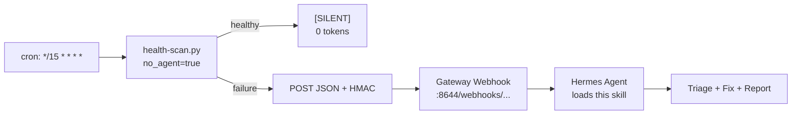

## Reference Library

| Document | Function | Load When... |
|----------|----------|--------------|
| `references/docker-container-recovery.md` | Docker timing-window diagnosis: distinguish self-healed containers from genuine outages using inspect timestamps, restart counts, and scan-time cross-referencing | • Docker probe failures • Container not running • Docker container health |
| `references/cron-pitfalls.md` | Debugging cron-launched Hermes jobs: `HOME` unreliability, Python venv resolution, launchd/minimal `PATH`, `no_agent=true` stdout rules, cross-platform cron pitfalls | • Cron job won't start or silently fails • "can't find python" in cron • Script runs in terminal but not in cron |
| `references/probe-design.md` | Core probe design philosophy: concrete observable unit tests vs. assumption-based checks. Covers process/HTTP/Docker/disk/DNS probes, SSH tunnel intercept, SSE 406 handling, interface binding, and `passes_if` inequality limitation | • Writing new probes • Probe always fails but service is healthy • Designing health checks from scratch |
| `references/probe-onboarding.md` | Step-by-step HTTP probe validation workflow: verify process is running, `lsof` to find what's on the port, curl-test the exact endpoint, cross-reference with process state, run full scanner | • Adding a new HTTP probe • Onboarding a new service to the watchdog • "My probe always fails" |
| `references/env-var-wiring.md` | Three-way HMAC secret match: `WEBHOOK_SECRET` in `.env`, `config.yaml`, and `webhook_subscriptions.json`. Full chain from shell wrapper → Python → gateway verification | • "Webhook POST failed: HTTP Error 401" • Auth failures on webhook POST • First-time watchdog setup |
| `references/probe-debugging.md` | Real-world process probe debugging: `--` flag trap on BSD grep, finding a process by port via `lsof` → `ps`, character class trick, pre-catalog verification, process+HTTP cross-reference matrix | • Process probe fails • "grep: unrecognized option" • First-run probe config bugs |
| `references/skill-onboarding-and-configuration.md` | 8-phase onboarding plan: install, introspection, webhook, cron, probes, testing, user approval, production. Also covers repair/diagnostics for the skill itself | • First-time setup • Reconfiguration after migration • Repair when cron/webhook/catalog is broken |
| `references/service-discovery-catalog.md` | Comprehensive list of discoverable Hermes services organized by layer: system, Hermes core, MCP/plugins, messaging, Docker, unsupervised processes — with probe commands for each | • Introspection/Phase 2 • "Find what services I have" • Onboarding on a new machine |

**Critical loading rule:** Load `skill-onboarding-and-configuration.md` and `service-discovery-catalog.md` ONLY in Context B (setup/reconfig/repair). NEVER load them during routine failure triage (Context A). See "Agent Guidance" below.

---

## Agent Guidance: Reference Loading Contexts

This skill runs in **two distinct contexts**. Loading the wrong reference wastes tokens and confuses the agent. Read these headers to determine your context before loading anything.

### Context A — Failure Triage (webhook-triggered)

**You are here if:** This session was started by a webhook POST from `health-scan.py`. The `{payload}` contains `failed_services` and probe results for specific services.

**Your job:** Triage the failed services listed in `failed_services`, run diagnosis tests, apply fixes per risk tier, verify, report.

**Reference loading rules for Context A:**
- **Load** only the reference file(s) matching the failure type(s) in `failed_services`. Example: a Docker container reported down → load `references/docker-container-recovery.md`.
- **DO NOT load** `references/skill-onboarding-and-configuration.md`. It's a full 8-phase onboarding plan (~22KB). Loading it during a routine Docker or gateway triage wastes tokens and adds nothing useful.
- If `failed_services` is empty or status is `ok` → something is wrong with the webhook wiring, not a real failure. Load `references/env-var-wiring.md`.
- Use the SKILL.md body (below) for risk tiers, circuit breaker, safety rules, and cascading failure detection — that content lives here, not in references.

### Context B — Setup / Reconfig / Repair (user-initiated)

**You are here if:** The user directly asked you to set up the system heath watchdog skill, reconfigure it, move it to a new machine, or fix a broken installation. There is no failure payload.

**Your job:** Onboard or repair the watchdog itself, not triage a specific service failure.

**Reference loading rules for Context B:**
- **Load** `references/skill-onboarding-and-configuration.md` — it contains the complete 8-phase plan: install, introspection, webhook creation, cron creation, probe creation, testing, user approval, production handoff.
- **Load** `references/service-discovery-catalog.md` during Phase 2 (introspection) — it provides the comprehensive list of discoverable services organized by layer with probe commands for each.
- Load individual references (like `probe-design.md`, `probe-onboarding.md`, `env-var-wiring.md`) when a specific phase calls for them. The onboarding doc tells you when.

---

Load only the file relevant to the current failure type when in Context A. Loading all eight unconditionally wastes tokens.

---

# System Health Watchdog

Two-stage pipeline: **Stage 1** (`health-scan.py`, `no_agent=True` cron) runs probes from `catalog.local.yaml`, outputs `[SILENT]` when healthy or JSON on failure. On failure, it POSTs the JSON to a Hermes webhook, which triggers **Stage 2** (this skill, agent-driven, webhook fired) to triage failures, apply fixes from catalog, verify, and report.

## Architecture



## Token Optimization (Design Principle)

Watchdog skills run frequently. Token waste compounds fast. Every design decision prioritizes zero-token healthy ticks:

1. **Minimal SKILL.md** — keep the loaded skill doc under 4K tokens. Move deep reference material into `references/` files that are loaded conditionally, not unconditionally.

2. **`[SILENT]` protocol** — the pre-scanner prints `[SILENT]` (and nothing else) when healthy. The cron job's `no_agent=True` script sees this and exits. No LLM is invoked on healthy ticks.

3. **Webhook event model** — Stage 2 has NO cron job. It's triggered exclusively by the webhook POST from Stage 1 on failure. Zero tokens consumed when everything's healthy.

4. **`no_agent=true` for the pre-scanner** — pure Python script, no LLM invoked. The script's stdout is delivered verbatim (or the `[SILENT]` protocol kicks in).

5. **Conditional reference loading** — the webhook-triggered agent loads `references/` files only when the pre-scanner detected a failure. Healthy path stays at zero tokens; failure path gets full context.


---

## Webhook Subscription

The pre-scanner's webhook POST is authenticated with HMAC-SHA256. The subscription lives in the **default** profile (`~/.hermes/webhook_subscriptions.json`) served by the default gateway.

- **URL:** `http://localhost:${WEBHOOK_PORT}/webhooks/system-health-alerts`
- **Secret:** stored in `~/.hermes/.env` as `WEBHOOK_SECRET` — must match `webhook_subscriptions.json` for `system-health-alerts`
- **Skill loaded:** `system-health-watchdog`
- **Deliver:** origin

## Payload Format

The pre-scanner POSTs the same JSON it prints to stdout. On failure:

```json
{"status": "failures", "failed": 2, "failed_services": ["gateway-default", "my-container"], "results": {"gateway-default": {"name": "Default Gateway", "passed": false, "failed_probes": ["process_running"]}}}
```

The webhook's prompt template injects this as `{payload}`. The agent loads this skill and triages each `failed_services` entry.

## Safety Rules (NEVER SKIP)

1. **Log scan false positive** — service passes process + HTTP probes but fails `log_scan` only → historical artifact, DO NOT restart
2. **Self-healed (launchd/systemd)** — `LastExitStatus=256` (launchd) or exited but process running + endpoint 200 → supervisor already recovered, DO NOT restart
3. **Self-healed (Docker)** — container was down at scan time but `docker inspect` shows running + `RestartCount=0` → Docker already recovered, DO NOT restart
4. **Timing window** — always re-run probes before applying ANY fix. If `[SILENT]` on re-scan → self-healed, report only
5. **No restart on false positive** — restarts drop sessions (Discord offset, Telegram spool), force re-indexing, risk data loss. Log artifacts are never worth this cost

## Risk Tiers

| Risk | Behavior |
|------|----------|
| `safe` | Auto-apply silently, verify, report summary |
| `caution` | Apply + report details |
| `hands_off` | Never auto-apply, report + explain |

## Circuit Breaker

Max **3 auto-remediations** per run. Max **3 retries** per `safe` fix, **1** for `caution`. Escalate to user after exhausted retries regardless of risk tier.

## Cascading Failures

Correlate errors within ±60s:
- `network_down`: DNS fail + multiple MCP connection fails → flush DNS (OS-appropriate command)
- `gateway_crash`: Gateway exit + downstream failures → check gateway logs
- `auth_expired`: 401 across multiple services → check OAuth tokens
- `disk_full`: Write failures across services → `df -h`

Fix dependencies first (DNS before MCP, system before services).

## Extending the Watchdog (Adding New Probes)

When asked to monitor a new service or process, **extend `catalog.local.yaml`** — do NOT create a new watchdog skill or new cron jobs.

The pre-scanner runs at pre-defined intervals via `system-health-pre-scanner`. Failure alerts are delivered via webhook. Just add a new service with probes.

**Quick Steps:**
1. **Load `references/service-discovery-catalog.md`** and run the 7-layer introspection workflow to find what's actually running on the machine before adding probes
2. Edit `catalog.local.yaml` (`~/.hermes/skills/devops/system-health-watchdog/catalog.local.yaml`)
3. Add service under `services:`
4. Define `health_probes:` (concrete checks only — see `references/probe-design.md`)
5. Add `diagnosis:` tests + `fixes:` (with `risk:` level: `safe` / `caution` / `hands_off`)

**Pitfall:** Never skip the discovery step. Running the full introspection sequence (`lsof` → `ps` → `curl` → cross-reference) is how you avoid probe config bugs — 90% of first-run failures are probe bugs, not service outages.

**Pitfall:** When asked to "add a probe" or "monitor X", don't create a new skill + new cron jobs. The infrastructure already exists — just add to the catalog. Creating `cron-health-watchdog` as a separate skill duplicated the two-stage pattern for no reason.

### Example: Adding Cron Job Health Probe

To monitor failing cron jobs (self-heal or alert on root cause):

1. **Add probe script to the catalog** — the skill ships with `scripts/cron-health-check.py` which runs `hermes cron list`, parses for `last_status != 'ok'` or `last_delivery_error`, and outputs `PASS` (exit 0) or `FAIL - <details>` (exit 1).

2. **Add to `catalog.local.yaml`**:
   ```yaml
   hermes-cron-jobs:
     name: "Active Cron Jobs"
     depends_on: []
     health_probes:
       - name: "jobs_exist"
         type: process
         command: "hermes cron list 2>&1"
         passes_if: '"Next run" in out'
       - name: "jobs_healthy"
         type: process
         command: "python3 scripts/cron-health-check.py"
         passes_if: '"PASS" in out'
     diagnosis:
       tests:
         - "hermes cron list"
     fixes:
       - name: "retry-failed"
         risk: caution
         max_retries: 1
         action: "hermes cron run <job_id>"
         verify: "python3 scripts/cron-health-check.py"
   ```

3. **Test**: Run `python3 health-scan.py` manually — should output `[SILENT]` when healthy, JSON when failures detected.

## Dry-Run Mode

When catalog has `dry_run: true`: run diagnosis + report, but **never** apply fixes or run terminal() for remediation. Respect this flag.

## Report Modes

| Mode | Behavior |
|------|----------|
| `silent` (default) | `[SILENT]` when green, summary when failures fixed |
| `summary` | "3 of 12 services failed. 2 auto-fixed. 1 needs attention." |
| `verbose` | Full pass/fail table with probe results, diagnosis, fix trace |

The webhook-triggered agent reads the `report_mode` field from the payload JSON. Default to `silent`.

## What This Skill Does NOT Do

- Auto-discovery of new services (load `references/service-discovery-catalog.md`, then see `references/skill-onboarding-and-configuration.md` Phase 2 for the full workflow)
- Probe debugging (use `references/probe-debugging.md`)
- Full onboarding from scratch (use `references/skill-onboarding-and-configuration.md`)
- Catalog schema reference (use `templates/catalog.default.yaml` — it's the documented schema)
- Health-scan.py debugging (use `references/cron-pitfalls.md` for cron issues, `references/env-var-wiring.md` for webhook issues)
